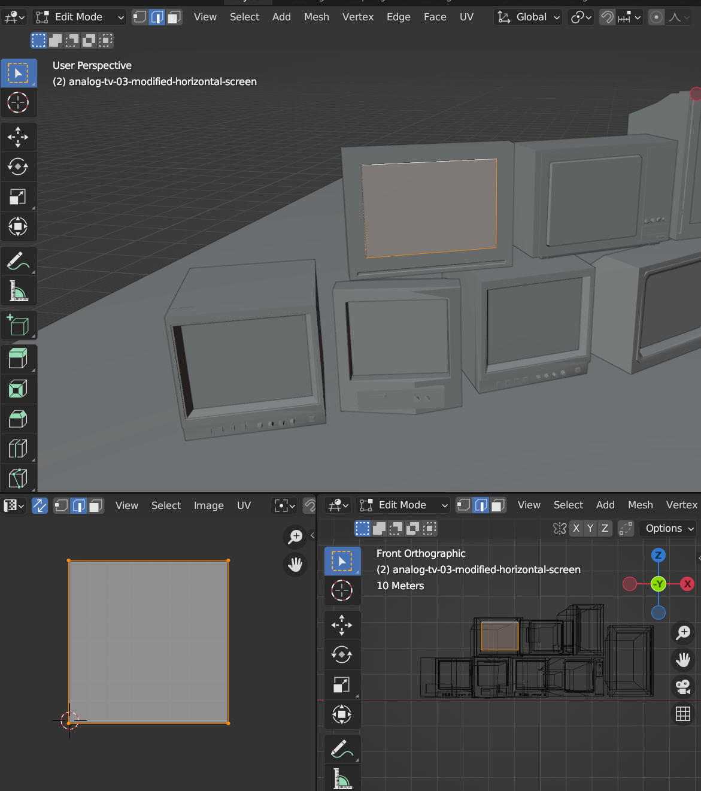

# Toshihito Endo's Portfolio

## Local server

```
npm run dev
```

## Debug the 3D 'atelier' model

In order to debug the 3D atelier model for changing objects, modifying collision objects, or adding shader new animations, etc, you need to temporarly deactivate the first person view control. So in these cases, comment codes in `Home.jsx` and `Experience.jsx` and activate `<Perf>`, `<axesHelper />`, `<OrbitControls makeDefault />`.

#### Home.jsx

```

  {/* {gameState !== gameStates.LOADING && <Menu />} */}

```


#### Experience.jsx

```

  {/* {isBrowser && <FirstPersonViewControl />} */}

  ....

      <Perf position="top-left" />
      <axesHelper />
      <OrbitControls makeDefault />

```

## Dev Memo 01 - UV of TV screens inside glb (gltf) models

In order to play videos inside screen inside glb models, UV should be properly unwrapped, otherwise it cannot play the video in the way you want.



```
import { useVideoTexture } from "@react-three/drei";

....


  const silkySphereVideoTexture = useVideoTexture(
    "./videos/three-d-visuals/Silkey_Sphere.mp4"
  );

  silkySphereVideoTexture.wrapS = THREE.RepeatWrapping;
  silkySphereVideoTexture.wrapT = THREE.RepeatWrapping;
  silkySphereVideoTexture.flipY = false;

....

    <mesh geometry={nodes["analog-tv-01-modified-square-screen"].geometry}>
        <meshBasicMaterial map={silkySphereVideoTexture} toneMapped={false} />
    </mesh>

    ....

```

## Dev Memo 02 - Upload the rigged animated character

An astronout model is animated using [mixamo](https://www.mixamo.com/#/) and exported as **fbx**. Then it's imported in Blender and exported as **gltf**. To generating the `jsx` code, [online gltf converter](https://gltf.pmnd.rs/) was used.

#### Play an animation

```
....

  const { actions } = useAnimations(animations, group);

  useEffect(() => {
    actions["Flying"].play();
  }, []);

....

```

## Dev Memo 03 - Gradient animation, GSAP x useScroll

The logic of the gradient animation in accordance with the scroll offset value is controlling [paused gsap animation](<https://gsap.com/docs/v3/GSAP/Tween/pause()/>) by [useScroll()](https://drei.docs.pmnd.rs/controls/scroll-controls) with the method of [seek()](<https://gsap.com/docs/v3/GSAP/Timeline/seek()/>) inside [useFrame()](https://r3f.docs.pmnd.rs/api/hooks#useframe).

```
....

const tl = useRef();
const backgroundColors = useRef({
  colorA: "#3535CC",
  colorB: "#ABAADD",
});

useLayoutEffect(() => {
  tl.current = gsap.timeline();

  tl.current.to(backgroundColors.current, {
    duration: 1.0,
    colorA: "black",
    colorB: "snow",
  });

  tl.current.pause();
}, []);
....

```

```
....
useFrame((state, delta) => {

  ....
  tl.current.seek(scrollOffset * tl.current.duration());
  ....

})
....

```
