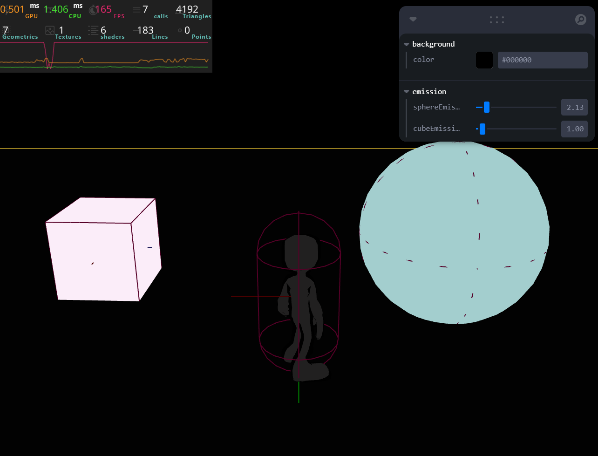
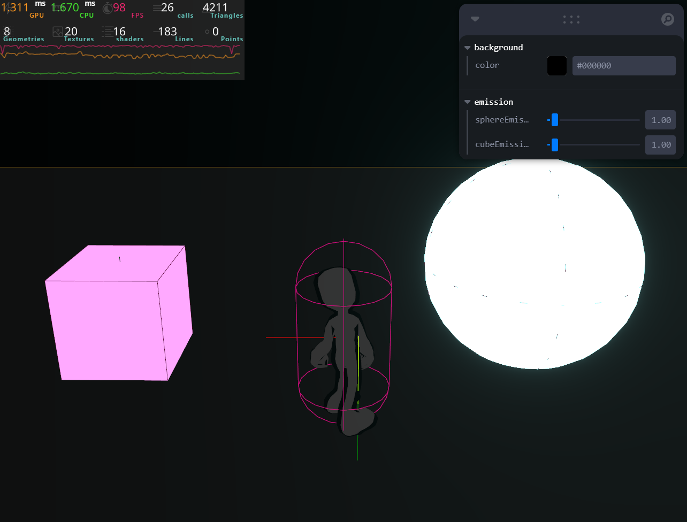
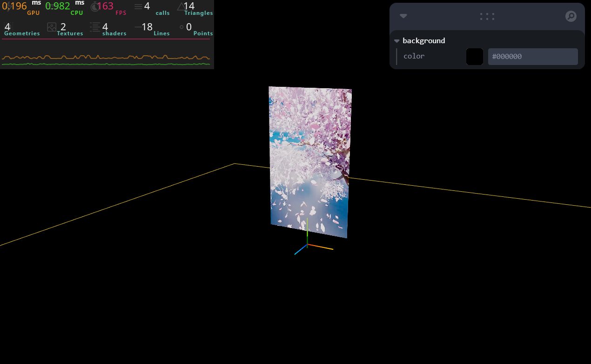
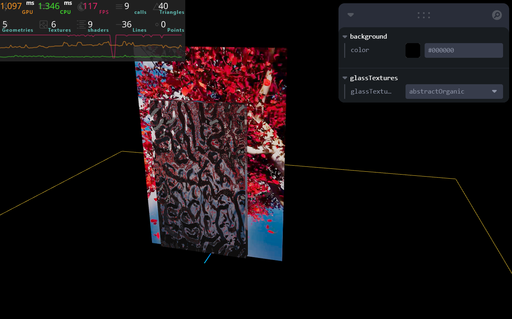

# Toshihito Endo's Portfolio

## 0. Physics test environment

<br>

### 0-0. Geometries

- Test cube
- Test icosahedron
- Test floor

### 0-1. Settings

- **Restitution:** 0.5
- **Friction:** 0.2

### 0-2. Test items

- **Keyboard input:** `WASD`, `Arrow`, `Space` and `Shift` keys
- **Force applied to objects:** `applyImpulse`, `applyTorqueImpulse`
- **Keybord input based control:** move (normal speed, fast speed), jump

## 1. Prepare a rigged character

### 1-a. Download a rigged character

You can directly download rigged characters from below sites. <br><br>

- [pmndrs market](https://market.pmnd.rs/)
- [Mixamo](https://www.mixamo.com/)
- [TURBOSQUID](https://www.turbosquid.com/)
- [Free3D](https://free3d.com/)
- [BLEND SWAP](https://www.blendswap.com/)

### 1-b. Upload the model and auto rigging via Mixamo

You can upload the model as the format of **fbx** to Mixamo for auto rigging. <br><br>
<br>
<br>

## 2. Add animations to the rigged character

### 2-0. Steps

- Prepare the model as the format of **"fbx"**
- Upload to [Mixamo](https://www.mixamo.com/#/)
- Find an animation and download it
- Attach the imported animation to the model in blender
- Export as **"gltf"** file

### 2-1. Import the gltf model into blender and exported as the fbx file

<br>
<br>

### 2-2. Upload the fbx model to mixamo

<br>
<br>
<br>

### 2-3. Select an animation and download it

<br>
<br><br>

Don't forget to check **"In Place"**.

### 2-4. Import the animation (fbx) to blender

<br>

### 2-5. Change "Editor Type" to "Dope Sheet", open "Action Editor" and rename the animation

<br>

### 2-6. Rename the original model, pose mode, open animation in action editor, hit "Push Down"

<br>
<br>
<br>
<br>

### 2-7. Change "Editor Type" to "Nonlinear Animation", rename, delete the animation model from Mixamo

<br>
<br>
<br>
<br>

### 2-8. Export the model as the format of gltf

<br>

### 2-9. Switch the model with animated one

Run gltfjsx again to generate the code, and switch the model with the animation one. <br>

```
npx gltfjsx public/models/female-cyborg/model.gltf
```

## 3-a. Character control with ecctrl

### 3-a-0. Documentation

- [pmndrs/ecctrl Git Repo](https://github.com/pmndrs/ecctrl?tab=readme-ov-file)

### 3-a-1. Install

```
npm install ecctrl
```

### 3-a-2. Set up `KeyboardControls` from drei

In order to use ecctrl, you need to set up [KeyboardControls](https://github.com/pmndrs/drei?tab=readme-ov-file#keyboardcontrols) from drei. In the below code, `KeyboardControls` is set up outside `<Canvas>` in case for implementing an user interface, but it can be inside `<Canvas>`.<br>

```
const keyboardMap = [
    { name: "forward", keys: ["ArrowUp", "KeyW"] },
    { name: "backward", keys: ["ArrowDown", "KeyS"] },
    { name: "leftward", keys: ["ArrowLeft", "KeyA"] },
    { name: "rightward", keys: ["ArrowRight", "KeyD"] },
    { name: "jump", keys: ["Space"] },
    { name: "run", keys: ["Shift"] },

    // Optional animation key map
    { name: "action1", keys: ["1"] },
    { name: "action2", keys: ["2"] },
    { name: "action3", keys: ["3"] },
    { name: "action4", keys: ["KeyF"] },
  ];

export default function App() {
  return (
    <>
      <Header />

      <KeyboardControls map={keyboardMap}>
        <Canvas
          camera={{
            fov: 45,
            near: 0.1,
            far: 200,
            position: [1, 5, 6],
          }}
        >
          <Experience />
        </Canvas>
      </KeyboardControls>
    </>
  );
}
```

### 3-a-3. Set up `Ecctrl` & `EcctrlAnimation` for animated character control

In below code, `Ecctrl` & `EcctrlAnimation` are set up inside the `Experience` component inside `<Canvas>`. <br>

```
....

import Ecctrl, { EcctrlAnimation } from "ecctrl";

....

export default function Experience() {
  const characterURL =
    "./models/fourth-dimensional-being/fourth-dimensional-being.gltf";

  const animationSet = {
    idle: "Idle",
    walk: "Walk",
    run: "Run",
    jump: "Jump_Start",
    jumpIdle: "Jump_Idle",
    jumpLand: "Jump_Land",
    fall: "Climbing", // This is for falling from high sky

    // Currently support four additional animations
    action1: "Wave",
    action2: "Dance",
    action3: "Cheer",
    action4: "Attack(1h)", // This is special action which can be trigger while walking or running
  };

  return (
    <>

      ....

      <Physics debug={Physics} timeStep="vary">

        ....

        <Ecctrl
          position={[0, 0, 0]}
          animated
        >
          <EcctrlAnimation
            characterURL={characterURL} // Must have property
            animationSet={animationSet} // Must have property
          >
            <FourthDimensionalBeing />  // The character component
          </EcctrlAnimation>
        </Ecctrl>

      </Physics>

    </>
  );
}
```

## 3-b. Character control with `KeyboardControls`

### 3-b-0. Set up `KeyboardControls` from drei

In order to control the character with the keyboard, you need to set up [KeyboardControls](https://github.com/pmndrs/drei?tab=readme-ov-file#keyboardcontrols) from drei. In the below code, `KeyboardControls` is set up outside `<Canvas>` in case for implementing an user interface, but it can be inside `<Canvas>`.<br>

```
const keyboardMap = [
    { name: "forward", keys: ["ArrowUp", "KeyW"] },
    { name: "backward", keys: ["ArrowDown", "KeyS"] },
    { name: "leftward", keys: ["ArrowLeft", "KeyA"] },
    { name: "rightward", keys: ["ArrowRight", "KeyD"] },
    { name: "jump", keys: ["Space"] },
    { name: "run", keys: ["Shift"] },

    // Optional animation key map
    { name: "action1", keys: ["1"] },
    { name: "action2", keys: ["2"] },
    { name: "action3", keys: ["3"] },
    { name: "action4", keys: ["KeyF"] },
  ];

export default function App() {
  return (
    <>
      <Header />

      <KeyboardControls map={keyboardMap}>
        <Canvas
          camera={{
            fov: 45,
            near: 0.1,
            far: 200,
            position: [1, 5, 6],
          }}
        >
          <Experience />
        </Canvas>
      </KeyboardControls>
    </>
  );
}
```

### 3-b-1. Create the `CharacterController` component
First you need to create the `CharacterController` component and wrap `Character` component with `RigidBody`.

```
<RigidBody>
    <Character />
</RigidBody>
```

### 3-b-2. Set up with `useKeyboardControls` 
In order to make the character move with keyboard inputs, first you need to set up `useKeyboardControls` from `@react-three/drei`.

```
const [subscribeKeys, getKeys] = useKeyboardControls();
```

### 3-b-3. Link ref to `RigidBody`
Making the character move involves the physics, thus you need to reference the character via `<RigidBody>`.

```
const body = useRef();

....

    <RigidBody ref={body} .... >
        <Character />
    </RigidBody>
```

### 3-b-4. Apply forces to make the character move
Using "getter" of `useKeyboardControls` to fetch keyboard input states, then apply forces to the model with `applyImpulse`. It's important to use and tweak "one vector" to apply forces otherwise unwanted forces could be applied to the character leading to unpredictable character movements. Applying forces needs to be done inside `useFrame`. For provide the same user experience regardless of device, the amount of applied force should be optimized through `delta`. The second boolean parameter of applyImpulse is to wake up the character (react three rapier system automatically sets objects sleep after several seconds).

```
useFrame((state, delta) => {
    // Get input key states
    const { forward, backward, leftward, rightward } = getKeys();

    // One vector for handling all applied forces
    const impluse = { x: 0, y: 0, z: 0 };

    // Move forward, backward, leftward, rightward
    if (forward) {
        impluse.z -= 3 * delta;
    }
    if (backward) {
        impluse.z += 3 * delta;
    }
    if (leftward ) {
        impluse.x -= 3 * delta;
    }
    if (rightward) {
        impluse.x += 3 * delta;
    }

    // Apply forces to the rigid body
    body.current.applyImpulse(impluse, true);
});
```

### 3-b-5. Use `CapsuleCollider` instead of default collider
For better and optimized physicall simulations, implement `CapsuleCollider`.

```
<RigidBody .... colliders={false} >
    <Character />
    <CapsuleCollider .... />
</RigidBody>
```

### 3-b-6. Prevent the character to fall on the ground
When the force is applied to the character, it will fall on the ground. To prevent it, tweak the enabledRotations attribute of `RigidBody`.

```
<RigidBody .... enabledRotations={[false, false, false]} >
    <Character />
    <CapsuleCollider .... />
</RigidBody>
```

### 3-b-7. Control the character movement speed to make it more natural
In order to create natural character movements, you need to limit its speed by accessing its movement speed via `linvel()` method. And also set `linearDamping` of `RigidBody` to automatically diminish applied forces.

```
useFrame((state, delta) => {
    // Get input key states
    const { forward, backward, leftward, rightward } = getKeys();

    // One vector for handling all applied forces
    const impluse = { x: 0, y: 0, z: 0 };

    // Access the character linear velocity
    const linvel = body.current.linvel();

    // Move forward, backward, leftward, rightward
    if (forward && linvel.z > -3) {
        impluse.z -= 3 * delta;
    }
    if (backward && linvel.z < 3) {
        impluse.z += 3 * delta;
    }
    if (leftward && linvel.x > -3) {
        impluse.x -= 3 * delta;
    }
    if (rightward && linvel.x < 3) {
        impluse.x += 3 * delta;
    }

    // Apply forces to the rigid body
    body.current.applyImpulse(impluse, true);
});

....

    <RigidBody .... linearDamping={0.5} >
        <Character />
        <CapsuleCollider .... />
    </RigidBody>
```

### 3-b-8. Face the character towards movement directions
It looks more natural if the character face the direction in which it moves. It can be done through accessing the character mesh and tweaking its rotation.

```
const character = useRef();

useFrame((state, delta) => {
    // Get input key states
    const { forward, backward, leftward, rightward } = getKeys();

    // One vector for handling all applied forces
    const impluse = { x: 0, y: 0, z: 0 };

    // Access the character linear velocity
    const linvel = body.current.linvel();

    // Control the character mesh rotation
    let changeRotation = false;

    // Move forward, backward, leftward, rightward
    if (forward && linvel.z > -3) {
        impluse.z -= 3 * delta;
        changeRotation = true;
    }
    if (backward && linvel.z < 3) {
        impluse.z += 3 * delta;
        changeRotation = true;
    }
    if (leftward && linvel.x > -3) {
        impluse.x -= 3 * delta;
        changeRotation = true;
    }
    if (rightward && linvel.x < 3) {
        impluse.x += 3 * delta;
        changeRotation = true;
    }

    // Rotate the character according to move directions
    if (changeRotation) {
      const angle = Math.atan2(linvel.x, linvel.z);
      character.current.rotation.y = angle;
    }

    // Apply forces to the rigid body
    body.current.applyImpulse(impluse, true);
});

....


    <RigidBody .... >

        <group ref={character}>
          <Character />
        </group>

        <CapsuleCollider .... />

    </RigidBody>
```

### 3-b-9. Use `zustand` for controlling the character animation state
First, you need to install `zustand`.
```
npm install zustand
```

<br>

And then, you need to creat a store for switching character animations. You also need to subscribe to the changes on the store, but the store currently doesn't allow subscribing. So here needs a trick. You need to use **Zustand middleware**. In `store.js`, import `subscribeWithSelector` from `zustand/middleware`.
```
import { create } from "zustand";
import { subscribeWithSelector } from "zustand/middleware";

export const useGameStore = create(
  subscribeWithSelector((set, get) => ({
    /**
     * CHARACTER ANIMATION CONTROLLER
     */
    characterState: "Idle",
    setCharacterState: (characterState) => {
      set({ characterState: characterState });
    },
  }))
);
```

### 3-b-10. Implement animation switch logic (`MangaStyleMan.jsx`, `CharacterControl.jsx`)
**`MangaStyleMan.jsx`**
```
// Animations: Idle, Walk, Run, Jump_Start, Jump_Idle, Jump_Land
const { actions } = useAnimations(animations, group);

// Import the character state
const characterState = useGameStore((state) => state.characterState);

// Switch character animations
useEffect(() => {
  actions[characterState].reset().fadeIn(0.01).play();

  return () => {
    actions[characterState].fadeOut(0.1);
    actions[characterState].stop();
  }

}, [characterState])
```

<br>

**`CharacterControl.jsx`**
```
/**
  * CHARACTER STATE
  */
const { characterState, setCharacterState } = useGameStore((state) => ({
  characterState: state.characterState,
  setCharacterState: state.setCharacterState,
}));

....

/**
  * MAKE THE CHARACTER MOVE
  */
const [subscribeKeys, getKeys] = useKeyboardControls();

 const WALK_SPEED = 2.5;
const RUN_SPEED = 5.0;

useFrame((state, delta) => {
  if (body.current) {
    // Get input key states
    const { forward, backward, leftward, rightward, run } = getKeys();

    // One vector for handling all applied forces
    const impluse = { x: 0, y: 0, z: 0 };

    // Access the character linear velocity
    const linvel = body.current.linvel();

    // Control the character mesh rotation
    let changeRotation = false;

    /**
      * Walk & Run
      */
    // Forward
    if (forward) {
      if (run && linvel.z > -RUN_SPEED) {
        impluse.z -= RUN_SPEED * delta;
        changeRotation = true;

        if (characterState !== "Run") {
          setCharacterState("Run");
        }
      } else if (linvel.z > -WALK_SPEED) {
        impluse.z -= WALK_SPEED * delta;
        changeRotation = true;

        if (characterState !== "Walk") {
          setCharacterState("Walk");
        }
      }
    }

    // Backward
    if (backward) {
      if (run && linvel.z < RUN_SPEED) {
        impluse.z += RUN_SPEED * delta;
        changeRotation = true;

        if (characterState !== "Run") {
          setCharacterState("Run");
        }
      } else if (linvel.z < WALK_SPEED) {
        impluse.z += WALK_SPEED * delta;
        changeRotation = true;

        if (characterState !== "Walk") {
          setCharacterState("Walk");
        }
      }
    }

    // Leftward
    if (leftward) {
      if (run && linvel.x > -RUN_SPEED) {
        impluse.x -= RUN_SPEED * delta;
        changeRotation = true;

        if (characterState !== "Run") {
          setCharacterState("Run");
        }
      } else if (linvel.x > -WALK_SPEED) {
        impluse.x -= WALK_SPEED * delta;
        changeRotation = true;

        if (characterState !== "Walk") {
          setCharacterState("Walk");
        }
      }
    }

    // Rightward
    if (rightward) {
      if (run && linvel.x < RUN_SPEED) {
        impluse.x += RUN_SPEED * delta;
        changeRotation = true;

        if (characterState !== "Run") {
          setCharacterState("Run");
        }
      } else if (linvel.x < WALK_SPEED) {
        impluse.x += WALK_SPEED * delta;
        changeRotation = true;

        if (characterState !== "Walk") {
          setCharacterState("Walk");
        }
      }
    }

    // Activate the idle animation when the character stops
    if (!forward && !backward && !rightward && !leftward) {
      if (characterState !== "Idle") {
        setCharacterState("Idle");
      }
    }

    // Rotate the character according to move directions
    if (changeRotation) {
      const angle = Math.atan2(linvel.x, linvel.z);
      character.current.rotation.y = angle;
    }

    // Apply forces to the rigid body
    body.current.applyImpulse(impluse, true);
  }
});

```

### 3-b-11. Let the camera follow the character
To let the camera follow the character movements, access its position through `getWorldPosition` of the character `mesh` (in this case, it's done with its `mesh` ref, `character`) and synchronize the both movements with adjusting the camera position & target (where the camera looks at). <br>

- **Camera position:** synchronize xz-axis, but y-axis is fixed
- **Camera target:** synchronize xyz-axis

```
useFrame((state, delta) => {
    // Get the character position
    const characterWorldPosition = character.current.getWorldPosition(
        new THREE.Vector3()
    );

    // Set the camera position
    state.camera.position.x = characterWorldPosition.x;
    state.camera.position.z = characterWorldPosition.z + 10;

    // Set the camera target
    const cameraTarget = new THREE.Vector3();
    cameraTarget.copy(characterWorldPosition);
    state.camera.lookAt(cameraTarget);
});
```

### 3-b-12. Let the light follow the character
**THREE JS MATRIX** <br>
Three.js updates object matrices when their transformation coordinates change (`position`, `rotation`, `scale`) but they need to be in the scene. In this case, the light is in the scene but not the `target`. Thus, you need to update the matrix of the `target` manually with the `updateMatrixWorld` method.<br>

```
export default function Lights() {
  const light = useRef();

  useFrame((state) => {
    const cameraPosition = state.camera.position;

    light.current.position.z = cameraPosition.z + 1 -4;
    light.current.target.position.z = cameraPosition.z - 4;
    light.current.target.updateMatrixWorld();
  });

  return (
    <>
      <directionalLight
        ref={light}
        castShadow
        position={[4, 4, 1]}
        intensity={4.5}
        shadow-mapSize={[1024, 1024]}
        shadow-camera-near={1}
        shadow-camera-far={10}
        shadow-camera-top={10}
        shadow-camera-right={10}
        shadow-camera-bottom={-10}
        shadow-camera-left={-10}
      />
      <ambientLight intensity={1.5} />
    </>
  );
}
```

## 4. Character control with sounds

### 4-0. Free sounds resources

- [freesound.org](https://freesound.org/)

### 4-1. useSound documentation

- [useSound documentation](https://www.joshwcomeau.com/react/announcing-use-sound-react-hook/)
- [useSound Github repo](https://github.com/joshwcomeau/use-sound)

### 4-2. Install useSound

```
npm install use-sound
```

### 4-3. Prepare for playing the character walk & run sound

In the below example, `playWalkSound()` & `playRunSound()` to play, `stopPlayWalkSound()` & `stopPlayRunSound()` to stop the sound. `isPlayingWalkSound` & `isPlayingRunSound` return boolean for indicating wheather the sound is currently playing or not. <br>

```
// Set up the walking sound
const [
  playWalkSound, // play sound method
  {
    stop: stopPlayWalkSound, // stop sound method
    isPlaying: isPlayingWalkSound, // return boolean
    sound: walkingSound, // allow access to "sound" object
  },
] = useSound(walkSound);

// Set up the running sound
const [
  playRunSound, // play sound method
  {
    stop: stopPlayRunSound, // stop sound method
    isPlaying: isPlayingRunSound, // return boolean
    sound: runingSound, // allow access to "sound" object
  },
] = useSound(runSound);
```

### 4-4. Walking & running SFX logic

Since we can subscribe the character state with zustand, let walking & running sounds play according to the character state. <br>

```
useEffect(() => {
    // Walk
    if (characterState === "Walk") {
      playWalkSound();
      walkingSound.loop(true); // allow looping
    } else {
      stopPlayWalkSound();
    }

    // Run
    if (characterState === "Run") {
      playRunSound();
      runingSound.loop(true); // allow looping
    } else {
      stopPlayRunSound();
    }
  }, [characterState]);

```

## 5. Bloom + geometry emissions

<br>


### 5-0. The approach

In order to apply the bloom effect to the scene in order for better performance, activate `PostProcessingEffects` (`EffectComposer` + `Bloom`) once the character starts moving. Thus, the order is like below; <br>

1. Scene is rendered
2. Press keys to move the character
3. Bloom effect gets activated

### 5-1. Code

To activate the bloom effect after one of the keys is pressed, in the `Experience` component, listening keyboard state with `useKeyboardControls` and let it control the activation of the bloom effect.

```
export default function Experience() {
  const [isCharacterStartMove, setIsCharacterStartMove] = useState(false);
  const [subscribeKeys, getKeys] = useKeyboardControls();

  useEffect(() => {
    const unsubscribeAny = subscribeKeys(() => setIsCharacterStartMove(true));

    return () => {
      return unsubscribeAny();
    };
  }, []);

  return (
    <>

      ....

      {isCharacterStartMove && <PostProcessingEffects />}

      ....

    </>
  );
}
```

### 5-2. Emission material blinking (`TestGeometriesEmission`)

In order to change the emission strength of materials, let it change frame by frame with `useFrame`.

```
export default function TestGeometriesEmission() {
  /**
   * REFS
   */
  const emissionSphereMesh = useRef();
  const emissionCubeMesh = useRef();

  /**
   * GUI
   */
  const { sphereEmission, cubeEmission } = useControls("emission", {
    sphereEmission: { value: 1, min: 0, max: 20, step: 0.01 },
    cubeEmission: { value: 1, min: 0, max: 20, step: 0.01 },
  });

  /**
   * BLINK PARAMS
   */
  const MIN_EMISSION_STRENGTH = 0.1;
  const BLINK_SPEED = 5;
  const BLINK_DELAY = 8;

  /**
   * BLINKING LOGIC BY FRAME
   */
  useFrame((state, delta) => {
    const time = state.clock.getElapsedTime();

    emissionSphereMesh.current.material.color.r =
      1.5 *
      (Math.sin(time * BLINK_SPEED + BLINK_DELAY) + 1 + MIN_EMISSION_STRENGTH);
    emissionSphereMesh.current.material.color.g =
      4 *
      (Math.sin(time * BLINK_SPEED + BLINK_DELAY) + 1 + MIN_EMISSION_STRENGTH);
    emissionSphereMesh.current.material.color.b =
      4 *
      (Math.sin(time * BLINK_SPEED + BLINK_DELAY) + 1 + MIN_EMISSION_STRENGTH);

    emissionCubeMesh.current.material.color.r =
      4 * (Math.sin(time * BLINK_SPEED) + 1 + MIN_EMISSION_STRENGTH);
    emissionCubeMesh.current.material.color.g =
      1.5 * (Math.sin(time * BLINK_SPEED) + 1 + MIN_EMISSION_STRENGTH);
    emissionCubeMesh.current.material.color.b =
      4 * (Math.sin(time * BLINK_SPEED) + 1 + MIN_EMISSION_STRENGTH);
  });

  return (
    <>
      <Suspense>
        <RigidBody colliders="ball" position={[-1.5, 1, 1.5]} scale={0.9}>
          <mesh ref={emissionSphereMesh} castShadow>
            <sphereGeometry />
            <meshBasicMaterial
              color={[
                1.5 * sphereEmission,
                4 * sphereEmission,
                4 * sphereEmission,
              ]}
              toneMapping={false}
            />
          </mesh>
        </RigidBody>
      </Suspense>

      <Suspense>
        <RigidBody position={[2, 1, 1.5]} scale={0.9}>
          <mesh ref={emissionCubeMesh} castShadow>
            <boxGeometry />
            <meshBasicMaterial
              color={[4 * cubeEmission, 1.5 * cubeEmission, 4 * cubeEmission]}
              toneMapping={false}
            />
          </mesh>
        </RigidBody>
      </Suspense>
    </>
  );
}
```

## 6. Lights

 Lights are super performance consumming, so use less lights as possible. <br>
 
 **Mimimum cost**
 - AmbientLight
 - HemisphereLight
 
 <br>

 **Moderate cost**
 - DirectionalLight
 - PointLight
 
 <br>

 **Hight cost**
 - SpotLight
 - RectAreaLight

 ## 7. Playing a video on plane geometry (`BeautyOfTimePassing.jsx`)
 
 
 <br><br>

 ```
import { useState } from "react";
import clearSceneryVideo from "../../../../public/videos/clear.mp4";

export default function BeautyOfTimePassing() {
  /**
   * SCENERY VIDEO SETUP AT THE INITIAL RENDER
   */
  const [video] = useState(() => {
    const vid = document.createElement("video");
    vid.src = clearSceneryVideo;
    vid.crossOrigin = "Anonymous";
    vid.loop = true;
    vid.muted = true;
    vid.play();
    return vid;
  });

  return (
    <>
      {/* VIDEO PLANE */}
      <mesh scale={[3, 5, 1]} position={[0, 3, 0]}>
        <planeGeometry />
        <meshStandardMaterial emissive={"snow"}>
          <videoTexture attach="map" args={[video]} />
          <videoTexture attach="emissiveMap" args={[video]} />
        </meshStandardMaterial>
      </mesh>


      ....

    </>
  );
}

```

## 8. Exploring the glass texture (`BeautyOfTimePassing.jsx`)


### 8-0. Free resources
- [3D TEXTURES by João Paulo](https://3dtextures.me/)
- [Poly Haven - "Textures"](https://polyhaven.com/textures)
- [ambienctCG](https://ambientcg.com/)
- [cgbookcase - "textures"](https://www.cgbookcase.com/textures)

### 8-1. Loading normal textures
To load textures, use `useLoader` from `@react-three/fiber`.

```
import * as THREE from "three";
import { useLoader } from "@react-three/fiber";

....

  const glassNormalTextureSnow01 = useLoader(
    THREE.TextureLoader,
    "./textures/snow/Snow004_1K-JPG_NormalGL.jpg"
  );
  const glassNormalTextureSnow02 = useLoader(
    THREE.TextureLoader,
    "./textures/snow/Snow004_1K-JPG_NormalDX.jpg"
  );
  const glassNormalTextureAbstractOrganic = useLoader(
    THREE.TextureLoader,
    "./textures/abstarct-organic/Abstract_Organic_002_NORM.jpg"
  );

....

```

### 8-2. Implement GUI for switching normal textures
In order to switch materials via GUI, use `useControls` from `leva` and there needs a bit of logic to show options properly. 

1. Prepare an object containing texture options
2. In GUI, show **"keys"** as options, not **"texture itself"**
3. In `meshPhysicalMaterial`, use **"the texutre object"** for normal mapping

```
import * as THREE from "three";
import { useLoader } from "@react-three/fiber";
import { RigidBody } from "@react-three/rapier";
import { useControls } from "leva";

export default function BeautyOfTimePassing() {
 
 ....

  /**
   * GLASS TEXUTRES
   */
  // Load normal textures for the glass plane
  const glassNormalTextureSnow01 = useLoader(
    THREE.TextureLoader,
    "./textures/snow/Snow004_1K-JPG_NormalGL.jpg"
  );
  const glassNormalTextureSnow02 = useLoader(
    THREE.TextureLoader,
    "./textures/snow/Snow004_1K-JPG_NormalDX.jpg"
  );
  const glassNormalTextureAbstractOrganic = useLoader(
    THREE.TextureLoader,
    "./textures/abstarct-organic/Abstract_Organic_002_NORM.jpg"
  );

  // The texture object used for "normalMap" attribute of meshPhysicalMaterial
  const GLASS_TEXTURES = {                              
    snow01: glassNormalTextureSnow01,
    snow02: glassNormalTextureSnow02,                         -------- 1        
    abstractOrganic: glassNormalTextureAbstractOrganic,
  };

  // GUI to display texture names
  const { glassTexture } = useControls("glassTextures", {
    glassTexture: {
      options: Object.keys(GLASS_TEXTURES),                   -------- 2             
    },
  });

  return (
    <>

      ....

      {/* GLASS PLANE */}
      <mesh scale={[3, 5, 0.25]} position={[0, 3, 1]}>
        <boxGeometry />
        <meshPhysicalMaterial
          attach="material"
          clearcoat={1.0}
          clearcoatRoughness={0.5}
          roughness={0.0}
          transmission={0.5}
          thickness={0.7}
          normalMap={GLASS_TEXTURES[glassTexture]}           -------- 3    
          color="snow"
        />
      </mesh>

      ....

    </>
  );
}

```